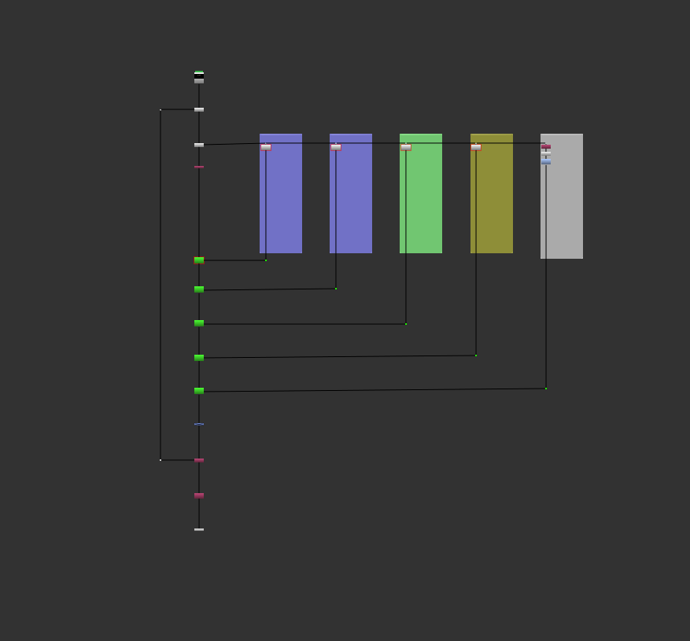

# Lola Grade LightGroupSetup

## GradeLightGroupGizmo

This is the development version of the tool based up on the lighting render template create by Aaron.

The gizmo is activated by hitting the `Get Light Groups` button which checks for lightgroups named "lgt##_pass_name" and creates a dropdown "lightgroup" with all the availiable lightgroups.

In the dev version this also sets up the "knob changed" callback on the dropdown

Internally the sliders connect to the grade and exposure knobs meaning that they can be controlled at an overall level or split between `direct` and `indirect` components

Access is only given to the `Exposure`, `Multiply` and 'Saturation' values so that any changes made can be replicated in the renderer if need be. The LightGroup Grader affects the colours or the Lights

### Assumptions:

- and `Unpremult/all`precedes the gizmo in the script
- pass names used are `diffuse_direct`, `diffuse_indirect`, `reflect_direct`, `reflect_indirect`, `refract_direct`, `refract_indirect`, `sss_direct`,`sss_indirect`
- lightgroups all contain the flag `lgt` followed by a number followed by the _pass_name

### Limitations:

- Emission is currently not handled by the tool and should be handled externally.
- unpremult/premult is done externally to the gizmo (this is part of our larger lighting/lookdev setup)

## Grade Albedo Gizmo

This divides the beauty ( can be applied after LightGroup manipulations) by the albedo. The albedo can then be graded and the result multiplied back.

Combining the Grade LightGroup and Grade Albedo gizmos correctly enables the colour of the lights and the shaders to be manipulated seperately.

## BreakOut Lightgroups

This generates a lighting mini comp from the selected render. Assuming beauty passes exist and match naming conventions renders will be seperated into lightgroup paths and recombined.
The b-pipe is respected and each raded lightgroup (and Emission if present) is recombined). The script includes a GradeAlbedo node.
For further customization  GradeLightGroup nodes can be duplicated in each pipe and masked to isolate key areas, then same can be done with the GradeAlbedo.

Original alpha is Copied back in after manipulations and passes are Removed so only RGBA is output at the foot of the minicomp.

  
